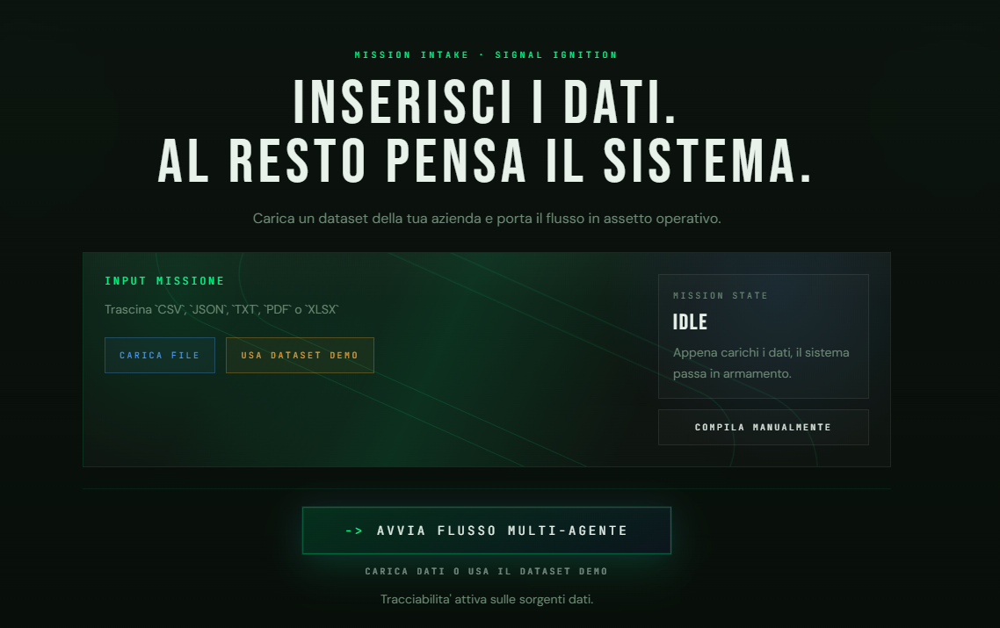
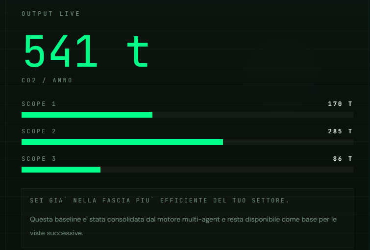
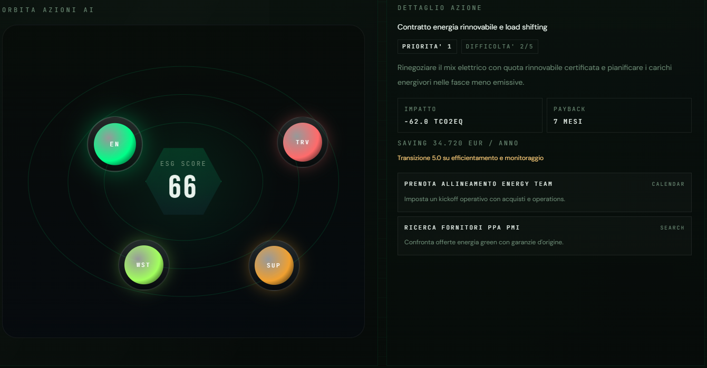
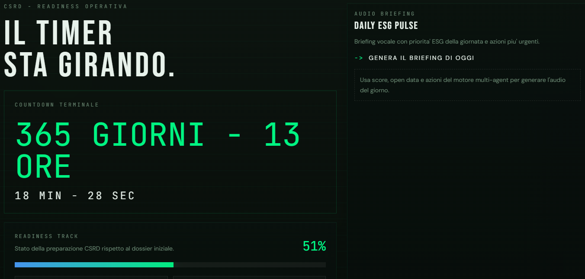

# EcoSignal Enterprise

EcoSignal Enterprise is a Next.js prototype that helps small and midsize companies turn scattered operational and environmental data into concrete sustainability actions.

Instead of stopping at dashboards, the app guides a team through a simple flow: collect company inputs, estimate Scope 1/2/3 emissions, enrich the picture with territorial context, generate AI-supported recommendations, and export communication/compliance material.

This repository was originally built for the Engineering challenge `EcoSignal: dai dati al gesto`, and it is now documented as a public project so new contributors can understand it quickly.

## What problem it solves

Many SMEs do not need more raw ESG data. They need help answering practical questions:

- Where are our emissions and operational risks today?
- Which actions should we prioritize first?
- What is the expected environmental and business impact?
- How can we communicate the result internally or for compliance work?

EcoSignal is a prototype for that workflow.

## What the app does

- Collects company data from manual input or uploaded files
- Estimates a carbon baseline across Scope 1, Scope 2, and Scope 3
- Calculates an ESG-style score from the onboarding data
- Pulls territorial context from live weather/open data sources, with deterministic fallback data for demos
- Generates prioritized actions with estimated CO2 reduction, savings, effort, and payback
- Produces an audio briefing and a downloadable CSRD-style PDF report
- Keeps the experience usable even when AI providers or third-party services are unavailable

## Product flow

The app is organized around four views inside the Mission Control interface:

1. `SCANNER`
   Company intake, source traceability, data upload, and baseline emissions.
2. `TERRA`
   Territorial context, climate signals, and sector-aware benchmarking.
3. `ORBITA`
   AI-generated recommendations and business/environmental trade-offs.
4. `COMPLIANCE`
   Readiness summary, audio briefing, and export of a CSRD-style report.

The current UI copy is mainly in Italian because the prototype was designed for Italian SMEs and judges, but the codebase and this README are now structured for broader public use.

## Screenshots

The repository now includes placeholder assets for four screenshots. Replace the SVG files in [`docs/screenshots`](./docs/screenshots) with real product captures when they are available.

| Planned view | Placeholder file | What to capture |
| --- | --- | --- |
| Intake and onboarding | `docs/screenshots/01-intake-overview.svg` | The first screen, upload area, and company input flow |
| Scanner baseline | `docs/screenshots/02-scanner-baseline.svg` | Scope 1/2/3 cards, source traceability, and baseline summary |
| AI recommendations | `docs/screenshots/03-orbita-actions.svg` | Action cards with impact, savings, and payback |
| Compliance output | `docs/screenshots/04-compliance-export.svg` | Readiness summary, audio briefing, and report export |






## Tech stack

- Next.js App Router
- React 19
- TypeScript
- Tailwind CSS
- Framer Motion
- jsPDF

Optional integrations:

- Gemini or Regolo for LLM-based multi-agent recommendations
- ElevenLabs for text-to-speech audio briefings
- Open-Meteo for live territorial context

## Project structure

```text
app/
  api/
components/
  mission-control/
data/
hooks/
lib/
  ai/
supabase/
```

Helpful files to start with:

- [`app/page.tsx`](./app/page.tsx) mounts the main Mission Control experience
- [`components/mission-control/MissionControlHome.tsx`](./components/mission-control/MissionControlHome.tsx) contains the core client flow
- [`lib/document-ingestion.ts`](./lib/document-ingestion.ts) handles file parsing and normalization
- [`lib/carbon.ts`](./lib/carbon.ts) calculates the carbon baseline
- [`lib/esg.ts`](./lib/esg.ts) computes the ESG-style score
- [`lib/open-data.ts`](./lib/open-data.ts) fetches live context and provides fallback demo data
- [`lib/ai/insights-orchestrator.ts`](./lib/ai/insights-orchestrator.ts) coordinates recommendation generation

## Quick start

### Requirements

- Node.js 20+
- npm

### Run locally

Copy `.env.example` to `.env.local`, then run:

```bash
npm install
npm run dev
```

Then open `http://localhost:3000`.

### Important note about environment variables

The app is designed to start even without every external service configured:

- No LLM credentials: AI insights fall back to a deterministic local multi-agent mode
- No ElevenLabs credentials: the audio endpoint returns a demo transcript instead of generated audio
- No live open-data response: territorial context falls back to deterministic demo data

That means you can explore the product flow locally before wiring up external providers.

## Environment variables

Copy `.env.example` to `.env.local` and fill in only what you need.

### Core optional integrations

- `GEMINI_API_KEY`
- `GEMINI_MODEL`
- `REGOLO_API_KEY`
- `REGOLO_API_URL`
- `REGOLO_MODEL`
- `ELEVENLABS_API_KEY`
- `ELEVENLABS_VOICE_ID`

### App configuration

- `NEXT_PUBLIC_CSRD_DEADLINE`

### Included in `.env.example` for future extensions

- `NEXT_PUBLIC_SUPABASE_URL`
- `NEXT_PUBLIC_SUPABASE_ANON_KEY`
- `SUPABASE_SERVICE_ROLE_KEY`
- `OPENAQ_API_KEY`

Some of these values are present for roadmap work and are not required for the current local demo flow.

## Supported input formats

Current ingestion support:

- `.json`
- `.csv`
- `.txt`

Behavior:

- Full JSON payloads can replace the current onboarding dataset
- CSV and TXT files are parsed as partial updates
- Unsupported formats are still registered as evidence, even if they are not deeply parsed yet

## API overview

Main routes exposed by the Next.js app:

- `POST /api/ai/insights` generates emissions summary, score, actions, and compliance summary
- `GET /api/open-data/context` fetches territorial context for a city and sector
- `POST /api/audio/briefing` builds a spoken summary, with demo fallback
- `POST /api/reports/csrd` exports a PDF report

## Reliability and fallback behavior

One of the strongest qualities of this prototype is that it remains demoable when external dependencies fail.

- LLM providers are attempted first; if they fail, the app returns structured local fallback insights
- Open data is fetched live when available; otherwise a deterministic context is generated
- Audio synthesis uses ElevenLabs when configured, otherwise it returns a text briefing

This makes the repository easy to run for first-time contributors and dependable during demos.

## Current limitations

- The UI text is still mostly Italian
- Advanced PDF/XLSX semantic extraction is not implemented yet
- Supabase persistence is scaffolded but not wired end-to-end in the visible product flow
- Agent traces are returned in data responses, but there is no dedicated diagnostic UI yet

## Suggested next steps for contributors

- Replace the screenshot placeholders with real product captures
- Add English UI copy or localization support
- Expand document ingestion beyond JSON/CSV/TXT
- Expose persistence and saved company sessions end to end
- Add tests around ingestion, scoring, and API fallbacks

## Origin

EcoSignal Enterprise started as a hackathon prototype focused on helping Italian SMEs move from environmental data to operational action. The current codebase already shows the core product idea; this README is meant to make that idea understandable to anyone landing on the repository for the first time.
